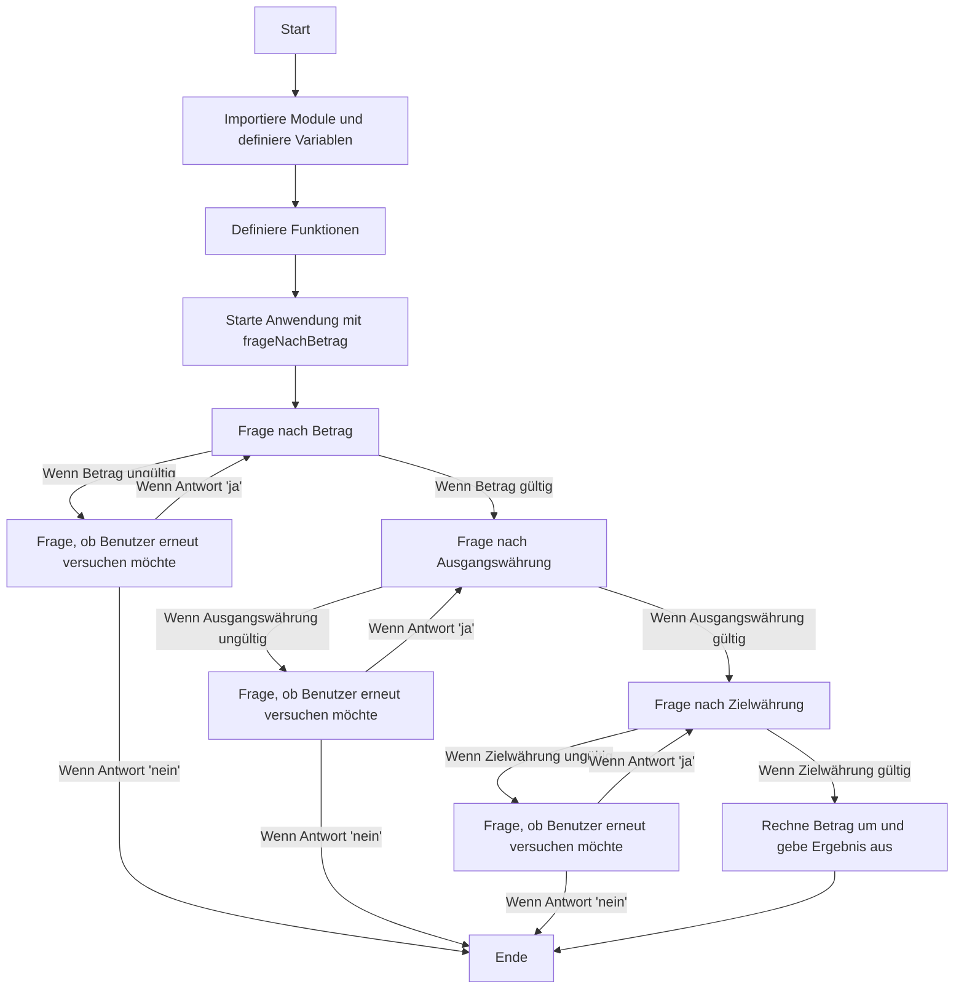

## Der Prozess beginnt bei "Start" (Knoten A).

### Zuerst werden Module importiert und Variablen definiert (Knoten B).

### Anschließend werden Funktionen definiert (Knoten C).

### Die Anwendung wird mit der Funktion frageNachBetrag() gestartet (Knoten D).

### Es wird nach dem Betrag gefragt (Knoten E). 

### Wenn der Betrag ungültig ist, wird gefragt, ob der Benutzer es erneut versuchen möchte (Knoten F). Wenn die Antwort "ja" ist, wird erneut nach dem Betrag gefragt (Knoten E). Wenn die Antwort "nein" ist, endet der Prozess (Knoten Z).

### Wenn der Betrag gültig ist, wird nach der Ausgangswährung gefragt (Knoten G). Wenn die Ausgangswährung ungültig ist, wird gefragt, ob der Benutzer es erneut versuchen möchte (Knoten H). Wenn die Antwort "ja" ist, wird erneut nach der Ausgangswährung gefragt (Knoten G). Wenn die Antwort "nein" ist, endet der Prozess (Knoten Z).

### Wenn die Ausgangswährung gültig ist, wird nach der Zielwährung gefragt (Knoten I). Wenn die Zielwährung ungültig ist, wird gefragt, ob der Benutzer es erneut versuchen möchte (Knoten J). Wenn die Antwort "ja" ist, wird erneut nach der Zielwährung gefragt (Knoten I). Wenn die Antwort "nein" ist, endet der Prozess (Knoten Z).

### Wenn die Zielwährung gültig ist, wird der Betrag umgerechnet und das Ergebnis ausgegeben (Knoten K), und der Prozess endet (Knoten Z).

